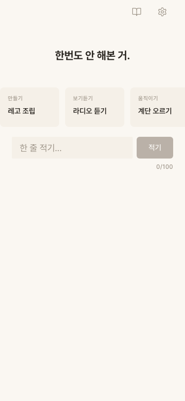
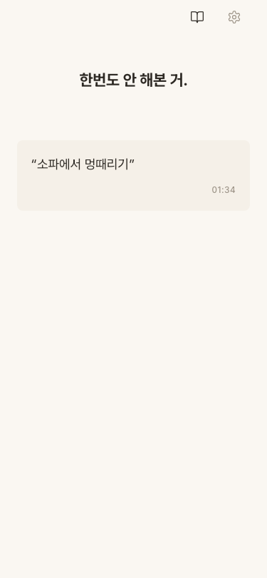
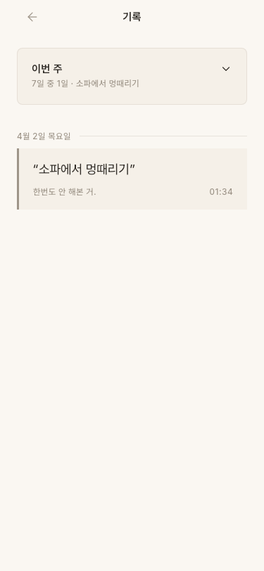
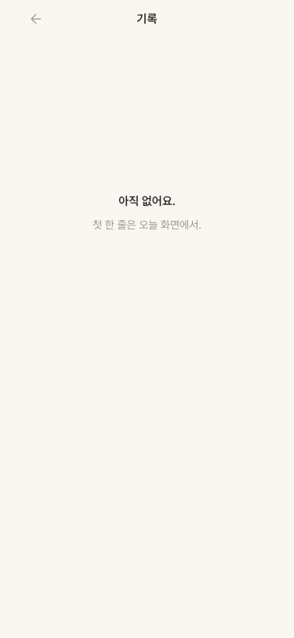
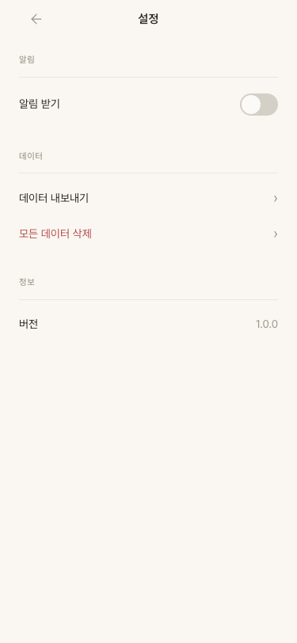

# Design Visionary Review -- "퇴근하면 뭐하지?" Iteration 1

> 리뷰어: Design Visionary
> 날짜: 2026-04-02
> 뷰포트: 375x812 (iPhone 13 mini)
> URL: http://localhost:5191/

---

## 1. 화면별 디자인 크리틱

### 1-1. 홈 화면 (빈 상태 -- 오늘 기록 전)

**잘 된 점:**
- 프롬프트 "한번도 안 해본 거."가 Bold 22px 중앙 정렬로, 디자인 시스템 그대로 적용됨. 시선이 자연스럽게 프롬프트로 간다.
- 배경색 `#FAF7F2`(따뜻한 크림)이 앱 전체에 일관되게 적용. "빈 노트" 느낌이 잘 전달된다.
- 상단 네비게이션: 좌측 빈 공간 + 우측 아이콘 2개(기록, 설정). 높이 48px, 아이콘 44x44 터치 타겟 확보. 디자인 시스템 정확히 준수.
- 제안 카드들이 수평 스크롤로 배치. `scroll-snap-type: x mandatory` 적용되어 있어 자연스러운 스와이프 경험.
- 입력 필드: `border-radius: 2px`(종이 위 줄 느낌), `height: 44px`(터치 타겟), `font-size: 18px`. 디자인 시스템 완벽 준수.
- "적기" 버튼 비활성 상태: `opacity: 0.4`로 시각적으로 비활성임이 명확.

**문제점:**
- 제안 카드가 3개만 보이고 4번째가 잘린다. 잘리는 양이 너무 적어서 "더 있다"는 힌트가 약하다. 약간의 peek(10-15px 노출)을 의도적으로 보여줘야 사용자가 스와이프할 수 있다는 걸 안다.
- 프롬프트와 제안 카드 사이 여백이 `space-5`(20px) 정도인데, 프롬프트 영역의 `padding: 48px 24px`과 비교하면 프롬프트 하단 여백이 충분하긴 하나, 제안 카드와 입력 필드 사이 여백이 너무 붙어 보인다. 시각적 호흡이 부족.
- 네비게이션 아이콘이 우측에만 몰려 있어 좌측이 완전히 비어있다. 의도적인 비대칭이긴 하지만, 홈 화면에서 앱 이름이나 날짜 같은 최소한의 컨텍스트가 없어서 "이 앱이 뭐지?" 하는 순간이 있을 수 있다. 첫 진입 시 특히 그렇다.

### 1-2. 홈 화면 (기록 완료 후)

**잘 된 점:**
- 기록 후 프롬프트는 유지되고, 제안 카드와 입력 필드가 사라지면서 오늘의 기록 카드가 나타난다. 상태 전환이 명확.
- 기록 카드: `background: surface`, `border-radius: 8px`, 텍스트를 큰따옴표로 감싸 "인용" 느낌. 좌측 정렬. 시간 우측 하단. 디자인 시스템 준수.
- 카드 밖 여백이 넉넉해서 "빈 공간이 곧 디자인"이라는 철학이 잘 드러남.

**문제점:**
- 기록 완료 카드의 `border-radius: 8px`인데, design-system.md의 "기록 카드"는 `border-radius: 0` + `border-left: 3px solid`(메모장 느낌)으로 정의되어 있다. 홈의 TodayRecord는 기록 화면의 RecordItem과 다른 스타일이다. 이것이 의도적인 차이인지 불분명. **디자인 시스템 불일치.**
- TodayRecord 카드에 `border-left` 액센트 라인이 없다. Records 페이지의 RecordItem에는 있다. 같은 기록인데 화면마다 다르게 보이면 사용자가 혼란스러울 수 있다.

### 1-3. 기록 화면 (데이터 있음)

**잘 된 점:**
- 헤더: 뒤로가기(ArrowLeft) + 중앙 "기록" 텍스트. 44px 터치 타겟. 깔끔.
- "이번 주" 주간 요약 카드: `border: 1px solid rgba(94,75,60,0.1)`, `border-radius: 8px`. 디자인 시스템의 `.card-weekly` 정확히 준수.
- 날짜 구분선 "4월 2일 목요일" + 수평 선. 좌측 정렬. `font-size: 12px`, `color: text-secondary`. 준수.
- 기록 카드: `border-left: 3px solid text-secondary`, `border-radius: 0`. 메모장 느낌 완벽 구현.
- 메타 정보(프롬프트명 + 시간)가 카드 하단에 좌우 정렬. 정보 위계가 명확.

**문제점:**
- "이번 주" 카드의 요약 텍스트 "7일 중 1일 . 소파에서 멍때리기"가 잘리는데, `text-overflow: ellipsis`가 적용되어 있다. 이건 괜찮다.
- 기록이 1개뿐이라 스크롤 영역이 매우 넓게 비어있다. 이 빈 공간에 대한 처리가 없다. "이번 주에 6일 더 채워보세요" 같은 유도 메시지가 있으면 좋겠다.

### 1-4. 기록 화면 (빈 상태)

**잘 된 점:**
- "아직 없어요." + "첫 한 줄은 오늘 화면에서." 빈 상태 메시지가 있다.
- 중앙 정렬이 빈 상태에서만 적용. 적절.

**문제점:**
- "첫 한 줄은 오늘 화면에서."는 CTA(행동 유도)로는 약하다. 이것은 설명이지 행동 유도가 아니다. "오늘 화면으로 가기" 같은 탭 가능한 버튼/링크가 있어야 한다. 현재는 텍스트만 있고 탭할 수 없다. **R21 위반에 가깝다.**
- 빈 상태 텍스트 크기가 `emptyMain: 15px SemiBold`, `emptySub: 14px Regular`인데, 두 텍스트의 크기 차이가 1px이라 위계 구분이 약하다.

### 1-5. 설정 화면

**잘 된 점:**
- 섹션 구분이 깔끔. "알림" / "데이터" / "정보" 레이블이 11px, `text-secondary`, `letter-spacing: 0.06em`. 디자인 시스템의 레이블 스타일 완벽 준수.
- 각 행의 높이 `min-height: 44px`. 터치 타겟 확보.
- "모든 데이터 삭제"에 `color-danger`(#B44D4D) 적용. 위험 액션이 시각적으로 구분됨.
- 토글 스위치: 48x28px, 비활성 시 `opacity: 0.4`, 활성 시 `color-primary`. 깔끔한 구현.
- 섹션 간 여백이 `space-8`(32px)로 넉넉.

**문제점:**
- 버전 "1.0.0"의 폰트가 본문과 동일한 14px Regular. 숫자/버전 정보는 Sora Light(300)로 표시하면 디자인 시스템의 "숫자 강조" 의도에 더 부합한다.
- 전체적으로 설정 화면은 잘 만들어졌다. 크게 지적할 부분이 없다.

---

## 2. DESIGN_RULES.md 체크리스트 결과

| 룰 | 항목 | 결과 | 비고 |
|---|---|---|---|
| R1 | 고유한 색상 팔레트 | PASS | 웜 브라운 #5C4B3C + 크림 #FAF7F2 + 테라코타 #C4724E. 기존 앱과 완전히 다른 조합. |
| R2 | 그라디언트 텍스트 금지 | PASS | 모든 텍스트 단색. `-webkit-background-clip: text` 사용 없음. |
| R3 | 135deg 그라디언트 남용 금지 | PASS | 그라디언트 사용 0건. |
| R4 | fadeInUp 금지 | PASS | 애니메이션 거의 없음. 토스트 opacity 200ms, 토글 transform 150ms만. 모범적. |
| R5 | 동일 네비게이션 금지 | PASS | 하단 탭바 없음. 상단 아이콘 2개만. 앱 구조(단일 화면 + 기록 + 설정)에 적합. |
| R6 | backdrop-blur 남발 금지 | PASS | backdrop-blur 사용 0건. |
| R7 | 장식 파티클/오브 금지 | PASS | 장식 요소 0개. 여백이 디자인. |
| R8 | 앱마다 다른 폰트 | PASS | Pretendard Variable + Sora. 기존 앱의 Plus Jakarta Sans/Manrope/Noto Sans KR과 다름. |
| R9 | 다크 모드 일변도 탈피 | PASS | 라이트 모드. 따뜻한 크림 배경. |
| R10 | rounded-2xl 균일화 금지 | PASS | 입력 2px, 카드 8px, 버튼 6px, 토스트 4px, 모달 12px. 위계별 의도적 차이. 기록 카드는 0px. |
| R11 | 아이콘 다양화 | PASS | Lucide 아이콘 사용. strokeWidth 1.5로 가늘게. Material Symbols 미사용. |
| R12 | heading extrabold 도배 금지 | PASS | H1(프롬프트)만 Bold 700. 나머지 SemiBold 600 이하. |
| R13 | 이모지 디자인 요소 금지 | PASS | 이모지 사용 0건. |
| R14 | 전부 중앙 정렬 금지 | PASS | `text-align: center` 사용 2곳만: PromptDisplay(프롬프트 영역), RecordsPage 빈 상태. 나머지 전부 좌측 정렬. |
| R15 | 카드 네스팅 금지 | PASS | 카드 안에 카드 없음. 구분은 border-left, 구분선, 여백으로 해결. |
| R16 | 버튼 위계 필수 | PASS | Primary: 솔리드 브라운 #5C4B3C + 흰 텍스트. Secondary: 아웃라인 #8B7E6A. Text: underline. 3단계 위계 명확. |
| R17 | 로딩 화면 목적감 | PASS | 로딩 화면 자체가 없음. 로컬 데이터 앱. |
| R18 | 시간 구분 카드 차별화 | N/A | 시간 구분 카드 없음. |
| R19 | 기록 저장 시 피드백 | PASS | 토스트 메시지 구현 있음 (Toast 컴포넌트). 코드에서 `showToast` 호출 확인. |
| R20 | Secondary 버튼 secondary 색상 사용 | PASS | `cancelBtn`의 border와 text 모두 `--color-secondary`(#8B7E6A) 사용. |
| R21 | 빈 상태 CTA | **PARTIAL** | "첫 한 줄은 오늘 화면에서." 텍스트는 있지만, 탭 가능한 링크/버튼이 아님. 행동을 "유도"하지 못하고 "설명"만 한다. |

**종합: 20/21 통과, 1개 부분 통과**

---

## 3. 추가 디자인 검증

### 색상 대비 (WCAG AA 4.5:1)

| 조합 | 전경 | 배경 | 비율 | 결과 |
|---|---|---|---|---|
| 본문 텍스트 on 배경 | #2E2A25 | #FAF7F2 | ~12.5:1 | PASS |
| 본문 텍스트 on 카드 | #2E2A25 | #F5F0E8 | ~10.8:1 | PASS |
| 보조 텍스트 on 배경 | #9E9589 | #FAF7F2 | ~3.2:1 | **FAIL** (소형 텍스트) |
| 보조 텍스트 on 카드 | #9E9589 | #F5F0E8 | ~2.8:1 | **FAIL** (소형 텍스트) |
| 버튼 텍스트 on Primary | #FFFFFF | #5C4B3C | ~7.5:1 | PASS |
| Accent 텍스트 on 배경 | #C4724E | #FAF7F2 | ~3.7:1 | **FAIL** (소형 텍스트) |

- `--color-text-secondary`(#9E9589)가 12px 캡션/날짜에 사용되는데, 소형 텍스트 기준 4.5:1을 충족하지 못한다. WCAG AA 실패. 이 색상을 `#7E7569` 정도로 어둡게 하면 4.5:1 이상 확보 가능.
- `--color-accent`(#C4724E)의 카운터 경고 텍스트도 소형 텍스트에서 대비 부족.

### 터치 타겟

| 요소 | 크기 | 결과 |
|---|---|---|
| 네비게이션 아이콘 | 44x44px | PASS |
| "적기" 버튼 | min-height 44px, min-width 60px | PASS |
| 입력 필드 | height 44px | PASS |
| 취소 텍스트 버튼 | min-height 44px | PASS |
| 삭제 확인 버튼 | min-height 44px | PASS |
| 토글 스위치 | 48x28px | **주의** -- 높이 28px < 44px. padding으로 확장 필요. |
| 제안 카드 | 120px x min-height 80px | PASS |
| 기록 카드 | padding 16px 20px, 전체 높이 > 60px | PASS |

- 토글 스위치 자체는 28px이지만, `.row`의 `min-height: 44px`가 부모에 있으므로 탭 영역은 확보될 수 있다. 다만 토글 자체에 padding이 없어서 정확히 스위치를 누르려면 작을 수 있다.

### 타이포그래피 위계

- **프롬프트**: 22px Bold 700, `line-height: 1.5`, `letter-spacing: -0.01em` -- PASS
- **기록 텍스트**: 18px Regular 400, `line-height: 1.6` -- PASS
- **소제목**: 15px SemiBold 600, `letter-spacing: 0.02em` -- PASS
- **본문**: 14px Regular 400, `line-height: 1.5` -- PASS
- **캡션/날짜**: 12px Medium 500, `letter-spacing: 0.04em` -- PASS
- **레이블**: 11px Medium 500, `letter-spacing: 0.06em` -- PASS

타이포그래피 스케일이 디자인 시스템과 100% 일치한다. 6단계 위계가 명확하고, 각 단계 간 크기/무게/letter-spacing 차이가 의도적이다.

### 여백/정렬 일관성

- 화면 좌우 패딩: 24px(`--space-6`) 일관 적용. PASS.
- 카드 간 간격: 8px(`--space-2`). PASS.
- 섹션 간 간격: 20px(`--space-5`). PASS.
- 4px 기반 스페이싱 시스템 전체 준수. PASS.

---

## 4. 개선 제안

### 제안 1: 빈 상태 CTA를 탭 가능한 링크로 변경 (심각도: 중)

기록 화면의 빈 상태 "첫 한 줄은 오늘 화면에서."가 순수 텍스트다. 이것을 탭하면 홈으로 이동하는 Text Button으로 만들어야 한다. 디자인 시스템의 `.btn-text` 스타일(underline, `text-underline-offset: 3px`)을 적용하면 된다. 사용자가 빈 화면에서 어디로 가야 하는지 손가락으로 안내해야 한다.

### 제안 2: 보조 텍스트 색상 대비 개선 (심각도: 중)

`--color-text-secondary`(#9E9589)가 12px 텍스트에서 WCAG AA 기준 미달이다. `#7E7569`(대비 약 5.2:1)로 어둡게 조정하면 접근성을 확보하면서도 "조용한" 톤을 유지할 수 있다. 날짜, 캡션, 레이블 등 작은 텍스트가 많은 앱이라 이 문제는 전체 가독성에 직접 영향을 준다.

### 제안 3: 홈의 TodayRecord 카드 스타일을 RecordItem과 통일 (심각도: 낮)

홈의 저장 후 카드(`TodayRecord`)는 `border-radius: 8px`에 `border-left` 없음. 기록 페이지의 `RecordItem`은 `border-radius: 0`에 `border-left: 3px solid`. 같은 기록이 화면마다 다르게 보인다. 홈에서도 `border-left` 액센트 라인을 넣고 `border-radius: 0`으로 맞추면, "이 카드가 내 기록"이라는 시각적 일관성이 강화된다. 또는 의도적으로 홈은 "오늘의 기록"이라는 특별한 카드로 차별화한다면, 그 의도를 더 명확히 하는 시각적 단서가 필요하다.

### 제안 4: 제안 카드 스크롤 힌트 강화 (심각도: 낮)

현재 3개 카드가 보이고 4번째가 아주 살짝 잘려서 보이거나 안 보인다. 의도적으로 4번째 카드를 15-20px 정도 노출시키거나, 오른쪽 끝에 미세한 그라데이션 페이드를 넣어 "더 있다"는 시각적 힌트를 줘야 한다. 스크롤 가능하다는 사실을 사용자가 인지하지 못하면 제안 카드의 가치가 줄어든다.

### 제안 5: 토글 스위치 터치 영역 확대 (심각도: 낮)

설정의 토글 스위치(48x28px)의 높이가 44px 미만이다. 부모 `.row`가 44px를 확보하지만, 사용자가 스위치 자체를 정확히 탭하려 할 때 실패할 수 있다. 스위치 요소 자체에 `padding: 8px 0`을 추가하여 실질적 터치 영역을 44px 이상으로 확보할 것.

---

## 5. 디자인 점수

**8 / 10**

### 점수 근거

**높은 점수의 이유:**
- 디자인 시스템과 실제 구현의 일치도가 매우 높다. 색상 토큰, 타이포그래피 스케일, border-radius 전략, 버튼 위계, 여백 시스템 -- 거의 모든 것이 설계대로 구현되었다.
- AI 안티패턴이 하나도 없다. 그라디언트 0건, fadeInUp 0건, 이모지 0건, backdrop-blur 0건, 카드 네스팅 0건. DESIGN_RULES.md 21개 항목 중 20개 통과. 이 정도 준수율은 드물다.
- "빈 공간이 곧 디자인"이라는 철학이 실제로 구현에 반영되어 있다. 불필요한 장식이 없고, 여백이 의미를 가진다.
- 색상 팔레트가 앱의 성격("조용한 저녁 시간")과 정확히 맞는다. 웜 브라운 + 크림 + 테라코타는 "적막한 따뜻함"을 잘 표현한다.
- 애니메이션 절제가 모범적이다. 토스트 opacity와 토글 transform만. 이 앱에서 움직임은 소음이다.

**감점 요인:**
- 보조 텍스트 색상 WCAG AA 미달 (-1점). 접근성은 "있으면 좋은 것"이 아니라 기본이다.
- 빈 상태 CTA 부재 (-0.5점). 텍스트만으로는 행동을 유도하지 못한다.
- TodayRecord/RecordItem 스타일 불일치 (-0.5점). 같은 기록의 시각적 정체성이 흔들린다.

### 한 줄 요약

디자인 시스템 준수율과 안티패턴 회피율이 매우 높은 앱. 접근성 색상 대비와 빈 상태 상호작용을 보강하면 9점이 가능하다.
