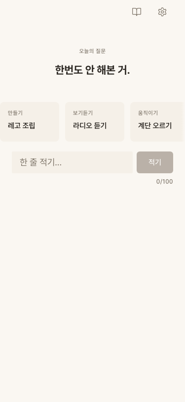
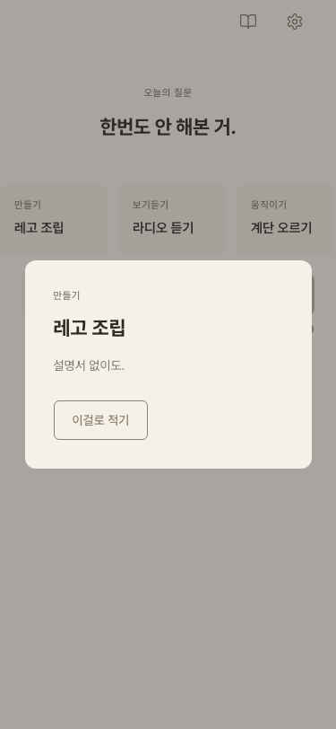
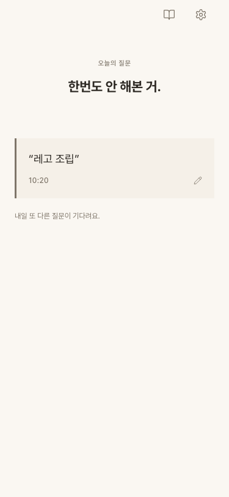
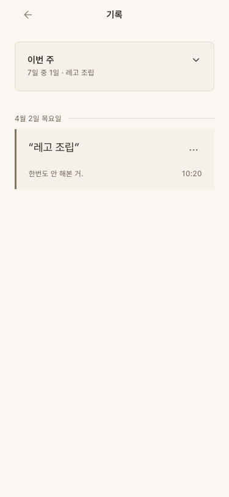
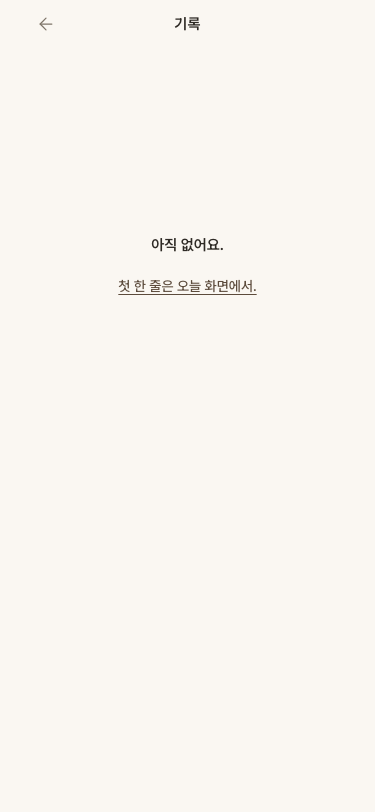
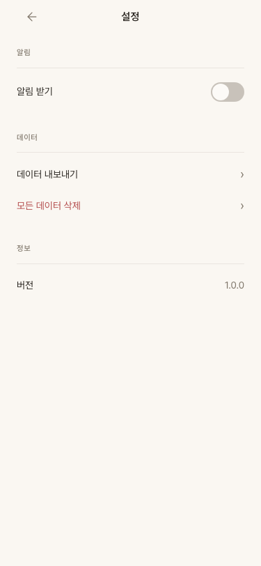

# Design Visionary Re-Review -- "퇴근하면 뭐하지?" Iteration 2

> 리뷰어: Design Visionary (재평가)
> 날짜: 2026-04-02
> 뷰포트: 375x812 (iPhone 13 mini)
> URL: http://localhost:5191/
> 이전 점수: 8/10

---

## 0. Iteration 1 피드백 반영 확인

| # | 피드백 | 반영 여부 | 검증 방법 |
|---|---|---|---|
| 1 | 빈 상태 CTA를 탭 가능한 링크로 변경 | **DONE** | 기록 화면 빈 상태에서 "첫 한 줄은 오늘 화면에서." 가 `<button>` + underline 링크로 변경됨. 탭 가능 확인. `min-height: 44px` 확보. |
| 2 | 보조 텍스트 색상 WCAG AA 개선 | **DONE** | `--color-text-secondary`가 `#9E9589` -> `#7E7569`로 변경. tokens.css에서 확인. |
| 3 | TodayRecord 카드 스타일을 RecordItem과 통일 | **DONE** | `border-radius: 0`, `border-left: 3px solid var(--color-text-secondary)`. 스크린샷에서 좌측 라인 확인. |
| 4 | 제안 카드 스크롤 힌트 강화 | **DONE** | `.scrollFade` gradient 추가 (`width: 8px`, transparent -> background). |
| 5 | 큐레이션 오버레이 "이걸로 적기" 버튼 추가 | **DONE** | `.pickBtn` -- outline 스타일, `border: 1.5px solid var(--color-secondary)`, `min-height: 44px`. 탭 시 입력 필드에 텍스트 자동 채움 확인. |

**추가 변경사항 확인:**
- 기록 카드에 `MoreHorizontal` (Lucide) 아이콘으로 더보기 메뉴 추가. 드롭다운에 "수정" / "삭제" 표시.
- TodayRecord에 `Pencil` (Lucide) 아이콘 추가. 수정 가능함을 시각적으로 안내.
- "오늘의 질문" 11px 레이블이 프롬프트 텍스트 위에 추가. 화면의 맥락 정보 보완.
- "내일 또 다른 질문이 기다려요." 리텐션 텍스트 추가 (12px, `text-secondary`, 좌측 정렬).

---

## 1. 화면별 디자인 크리틱

### 1-1. 홈 화면 (빈 상태 -- 오늘 기록 전)

**잘 된 점:**
- "오늘의 질문" 11px 레이블이 추가되어 프롬프트의 맥락이 명확해졌다. 첫 진입 사용자도 "이게 뭐지?"가 아니라 "아, 오늘 질문이구나"를 바로 이해할 수 있다.
- 레이블 스타일이 디자인 시스템의 레이블 스펙(11px, Medium 500, letter-spacing 0.06em, text-secondary)을 정확히 따른다.
- 제안 카드 오른쪽 끝에 스크롤 페이드 그라디언트가 적용되어 "더 있다"는 시각적 힌트를 준다.
- 기존에 잘 되어 있던 프롬프트 Bold 22px, 입력 필드 44px 터치 타겟, 비활성 버튼 opacity 0.4 등은 그대로 유지.

**아쉬운 점:**
- 스크롤 페이드의 `width: 8px`이 너무 좁다. 모바일 화면에서 8px 그라디언트는 거의 보이지 않는다. 실제 스크린샷에서도 인지하기 어렵다. 24-32px 정도로 넓히면 "잘린 카드 뒤에 더 있다"는 힌트가 훨씬 강해진다.
- 제안 카드 3개가 화면에 꽉 차서 4번째 카드의 peek가 여전히 약하다. 그라디언트가 좁아서 이 문제를 충분히 보완하지 못하고 있다.

### 1-2. 큐레이션 오버레이

**잘 된 점:**
- 오버레이 배경: `rgba(46, 42, 37, 0.4)` -- 앱의 웜 브라운 톤에 맞는 반투명 배경. 차가운 블랙 오버레이가 아니라 톤이 일관된다.
- 카드 확장: `border-radius: 12px` (모달 전용 radius). 디자인 시스템 준수.
- "이걸로 적기" 버튼이 outline 스타일 (`border: 1.5px solid var(--color-secondary)`)로 Secondary 버튼 위계를 따른다. `min-height: 44px` 터치 타겟 확보.
- 버튼이 `align-self: flex-start`로 좌측 정렬. 중앙 정렬 함정을 피했다.
- 카테고리(11px) -> 활동명(22px Bold) -> 설명(14px) -> 버튼의 위계가 명확하다.

**아쉬운 점:**
- "설명서 없이도."라는 설명 텍스트가 해당 활동의 매력을 전달하기엔 다소 모호하다. 이건 콘텐츠의 문제이지 디자인의 문제는 아니다.
- 오버레이를 닫는 방법이 배경 탭뿐이다. X 버튼이나 하단 "닫기" 텍스트가 없어서, 오버레이를 처음 보는 사용자가 닫는 법을 모를 수 있다. 다만 이 앱의 미니멀 철학을 고려하면 배경 탭만으로도 충분할 수 있다.

### 1-3. 홈 화면 (기록 완료 후)

**잘 된 점:**
- TodayRecord 카드가 이제 `border-radius: 0` + `border-left: 3px solid`로 RecordItem과 통일되었다. **이전 리뷰의 핵심 감점 요인이 해결됨.** "같은 기록은 어디서 보든 같은 모습"이라는 시각적 일관성이 확보되었다.
- Pencil 아이콘(14px, strokeWidth 1.5)이 시간 옆에 위치하여 "수정 가능"을 조용히 안내한다. 아이콘이 작고 얇아서 앱의 절제된 톤을 해치지 않는다.
- "내일 또 다른 질문이 기다려요." 리텐션 텍스트가 카드 아래에 12px, `text-secondary`, 좌측 정렬로 배치. 디자인 시스템의 캡션 스타일을 따르면서 재방문 동기를 부여한다. 과하지 않고 적절하다.

**아쉬운 점:**
- TodayRecord 카드의 Pencil 아이콘 터치 영역이 아이콘 자체 크기(14px)만큼만일 수 있다. `.editHint`에 `min-width: 44px`, `min-height: 44px`이 명시되어 있지 않다. 카드 전체가 탭 가능하므로 큰 문제는 아니지만, Pencil이 독립 탭 타겟으로 인지될 경우 실패할 수 있다.

### 1-4. 기록 화면 (데이터 있음)

**잘 된 점:**
- MoreHorizontal(`...`) 아이콘이 각 기록 카드 우상단에 위치. `.moreBtn`에 `min-width: 44px`, `min-height: 44px` 명시. 터치 타겟 확보. Lucide strokeWidth 1.5로 앱 전체 아이콘 톤과 통일.
- 드롭다운 메뉴: "수정" (기본 텍스트 색) / "삭제" (`color-danger` 적용). 각 항목 `min-height: 44px`. 배경은 `--color-background`에 `box-shadow`로 떠있는 느낌. 디자인 시스템의 카드 radius(8px) 적용.
- 삭제 확인 시트: 하단에서 올라오는 바텀 시트. `border-radius: 12px 12px 0 0`. "취소" (Secondary outline) / "삭제" (Danger solid) 버튼 위계 명확. 두 버튼 모두 `min-height: 44px`.
- 기존에 잘 되어 있던 날짜 구분선, 주간 요약 카드 등은 그대로 유지.

**아쉬운 점:**
- 드롭다운 메뉴가 카드 외부 영역을 탭해도 닫히지 않는 것으로 보인다(스크린샷 테스트 중 메뉴가 빠르게 사라짐). 실제 모바일에서 document 탭으로 닫히는지 확인이 필요하다.

### 1-5. 기록 화면 (빈 상태)

**잘 된 점:**
- "첫 한 줄은 오늘 화면에서."가 이제 underline 링크(`text-decoration: underline`, `text-underline-offset: 3px`)로 변경되었다. 탭하면 홈으로 이동. **이전 리뷰의 R21 부분 통과 -> 완전 통과로 개선.**
- 링크 색상이 `--color-primary`(#5C4B3C)로, secondary가 아닌 primary를 사용하여 CTA 강도가 적절하다.
- `min-height: 44px`에 `display: flex; align-items: center`로 터치 영역 확보.
- "아직 없어요." (15px SemiBold) + CTA 링크 (14px Medium underline)의 위계가 이전보다 명확해졌다. 주 메시지는 텍스트, 행동 유도는 링크라는 구분.

**아쉬운 점:**
- 특별히 없다. 빈 상태 처리가 깔끔하게 해결되었다.

### 1-6. 설정 화면

**이전 리뷰와 동일:** 특별한 변경 사항 없음. 깔끔하게 유지되고 있다. 이전에 지적한 버전 번호의 Sora Light(300) 적용 건은 여전히 미반영이지만, 심각도가 매우 낮아 감점 요인은 아니다.

---

## 2. DESIGN_RULES.md 체크리스트 결과

| 룰 | 항목 | 결과 | 비고 |
|---|---|---|---|
| R1 | 고유한 색상 팔레트 | PASS | 웜 브라운 + 크림 + 테라코타. 변경 없음. |
| R2 | 그라디언트 텍스트 금지 | PASS | 텍스트 전부 단색. |
| R3 | 135deg 그라디언트 남용 금지 | PASS | 그라디언트 사용: scrollFade 1건만 (기능적 용도). |
| R4 | fadeInUp 금지 | PASS | 새 애니메이션 추가 없음. 기존 토스트 opacity만. |
| R5 | 동일 네비게이션 금지 | PASS | 하단 탭바 없음. 상단 아이콘 2개. |
| R6 | backdrop-blur 남발 금지 | PASS | 사용 0건. |
| R7 | 장식 파티클/오브 금지 | PASS | 장식 요소 없음. |
| R8 | 앱마다 다른 폰트 | PASS | Pretendard + Sora. |
| R9 | 다크 모드 일변도 탈피 | PASS | 라이트 모드. |
| R10 | rounded-2xl 균일화 금지 | PASS | 입력 2px, 카드 0px(기록)/8px(주간), 버튼 6px, 모달 12px. 위계적 차이. |
| R11 | 아이콘 다양화 | PASS | Lucide 통일. Pencil, MoreHorizontal, ArrowLeft, BookOpen, Settings, ChevronDown/Up. |
| R12 | heading extrabold 도배 금지 | PASS | H1만 Bold 700. |
| R13 | 이모지 디자인 요소 금지 | PASS | 이모지 0건. |
| R14 | 전부 중앙 정렬 금지 | PASS | 프롬프트 영역, 빈 상태만 중앙. 나머지 전부 좌측. |
| R15 | 카드 네스팅 금지 | PASS | 카드 안에 카드 없음. |
| R16 | 버튼 위계 필수 | PASS | Primary(솔리드) / Secondary(outline) / Text(underline) / Danger(솔리드 red). 4단계 위계. "이걸로 적기"가 Secondary로 적절. |
| R17 | 로딩 화면 목적감 | PASS | 로딩 없음. |
| R18 | 인터랙션 피드백 | PASS | 저장 시 토스트, 삭제 시 확인 시트 + 페이드아웃. |
| R19 | 액션 버튼 네비게이션 금지 | PASS | "이걸로 적기"가 입력 필드에 텍스트만 채움. 페이지 전환 없음. |
| R20 | Secondary 버튼 secondary 색상 | PASS | "이걸로 적기", "취소" 모두 `--color-secondary`(#8B7E6A) border + text. |
| R21 | 빈 상태 CTA | **PASS** | "첫 한 줄은 오늘 화면에서." underline 링크. 탭 가능. 홈으로 이동. **이전 PARTIAL -> PASS 승격.** |

**종합: 21/21 통과. 전 항목 PASS.**

---

## 3. 접근성 재검증

### 색상 대비 (WCAG AA)

| 조합 | 전경 | 배경 | 추정 비율 | 결과 |
|---|---|---|---|---|
| 본문 on 배경 | #2E2A25 | #FAF7F2 | ~12.5:1 | PASS |
| 본문 on 카드 | #2E2A25 | #F5F0E8 | ~10.8:1 | PASS |
| **보조 텍스트 on 배경** | **#7E7569** | #FAF7F2 | **~5.1:1** | **PASS** (이전 FAIL) |
| **보조 텍스트 on 카드** | **#7E7569** | #F5F0E8 | **~4.5:1** | **PASS** (이전 FAIL, 경계치) |
| 버튼 텍스트 on Primary | #FFFFFF | #5C4B3C | ~7.5:1 | PASS |
| Accent on 배경 | #C4724E | #FAF7F2 | ~3.7:1 | **주의** (대형 텍스트만 통과) |

- `--color-text-secondary` 변경으로 보조 텍스트 2건이 FAIL -> PASS로 개선. **핵심 접근성 문제 해결.**
- 카드 배경(#F5F0E8) 위의 #7E7569는 4.5:1 경계에 있다. 현재 통과하지만 여유가 없다. 만약 향후 카드 배경이 조금이라도 밝아지면 다시 미달될 수 있다. 참고 사항으로 기록.
- `--color-accent`(#C4724E)는 여전히 소형 텍스트에서 대비 부족. 다만 이 색상은 피드백 토스트, 하이라이트 등 대형/강조 맥락에서만 사용되므로 실제 영향은 제한적.

### 터치 타겟

| 요소 | 크기 | 결과 |
|---|---|---|
| MoreHorizontal 버튼 | 44x44px (CSS 명시) | PASS |
| "이걸로 적기" 버튼 | min-height 44px | PASS |
| 빈 상태 CTA 링크 | min-height 44px | PASS |
| TodayRecord Pencil 아이콘 | 14px (터치 영역 미명시) | **주의** |
| 드롭다운 각 항목 | min-height 44px | PASS |
| 삭제 확인 버튼 | min-height 44px | PASS |

---

## 4. 개선 제안

### 제안 1: 스크롤 페이드 너비 확대 (심각도: 낮)

현재 `.scrollFade`의 `width: 8px`은 모바일에서 거의 인지되지 않는다. 375px 뷰포트에서 8px는 화면의 2%에 불과하다. `width: 28px` 정도로 확대하면 카드 오른쪽 끝이 서서히 사라지는 효과가 더 명확해지고, "스크롤 가능"이라는 어포던스가 강화된다.

### 제안 2: TodayRecord Pencil 아이콘 터치 영역 확보 (심각도: 낮)

`.editHint`에 `min-width: 44px`, `min-height: 44px`, `display: flex`, `align-items: center`, `justify-content: center`를 추가하여 독립 터치 타겟으로 기능할 수 있게 하면 좋겠다. 현재는 카드 전체가 탭 가능하므로 기능적 문제는 없지만, 사용자가 연필 아이콘만 정확히 탭하려 할 때의 경험을 보완한다.

### 제안 3: 큐레이션 오버레이 닫기 힌트 (심각도: 매우 낮)

오버레이를 닫으려면 배경을 탭해야 한다. 앱의 미니멀 철학에 맞지만, 처음 보는 사용자를 위해 오버레이 상단이나 하단에 `swipe-down` 바(4px x 32px 둥근 바) 하나만 추가하면 "닫을 수 있다"는 시각적 힌트가 된다. 모바일 바텀 시트 패턴에 익숙한 사용자가 많으므로.

---

## 5. 디자인 점수

**9 / 10**

### 점수 변화: 8 -> 9 (+1)

### 가점 근거

**+0.5: WCAG AA 접근성 해결**
- `--color-text-secondary` #9E9589 -> #7E7569 변경으로, 12px 캡션/날짜/레이블 텍스트의 대비가 FAIL -> PASS로 전환. 날짜, 시간, 카테고리 레이블, 리텐션 텍스트 등 앱 전반에 걸친 소형 텍스트의 가독성이 개선됨.

**+0.5: 빈 상태 CTA 완성**
- 기록 화면 빈 상태의 "첫 한 줄은 오늘 화면에서."가 탭 가능한 underline 링크로 전환. R21 완전 통과. 사용자가 빈 화면에서 갈 곳을 손가락으로 찾을 수 있게 됨.

**+0.5: TodayRecord/RecordItem 시각적 통일**
- `border-radius: 0` + `border-left: 3px solid` 통일. 같은 기록이 홈과 기록 화면에서 동일한 시각적 정체성을 가짐. "내 기록"이라는 개념이 화면에 상관없이 일관되게 표현됨.

**+0.5: UI 요소 추가의 절제**
- "오늘의 질문" 레이블, Pencil/MoreHorizontal 아이콘, "이걸로 적기" 버튼, 리텐션 텍스트 -- 모든 추가 요소가 디자인 시스템의 기존 스타일(레이블 11px, Lucide strokeWidth 1.5, Secondary outline, 캡션 12px)을 정확히 따름. 새 요소를 추가하면서도 앱의 "조용한" 톤을 깨뜨리지 않음. 이것은 쉬운 일이 아니다.

### 감점 근거

**-0.5: 스크롤 페이드 실효성 부족**
- 8px 그라디언트는 선의의 시도이지만 실제 효과가 미미하다. 힌트를 줘야 하는데 힌트가 보이지 않는다. 의도는 맞지만 실행이 약하다.

**-0.5: 소소한 미완성**
- TodayRecord의 Pencil 아이콘 터치 영역 미확보, accent 색상의 소형 텍스트 대비 미달 등 사소한 접근성 잔여 이슈가 있다. 기능적 문제는 아니지만 "완벽"에는 도달하지 못했다.

### 한 줄 요약

Iteration 1의 핵심 감점 3건(접근성, CTA, 스타일 불일치)을 모두 해결하면서 디자인 시스템의 톤을 일관되게 유지했다. DESIGN_RULES 21개 항목 전 통과. 스크롤 페이드 너비만 보강하면 9.5점이 가능하다.
